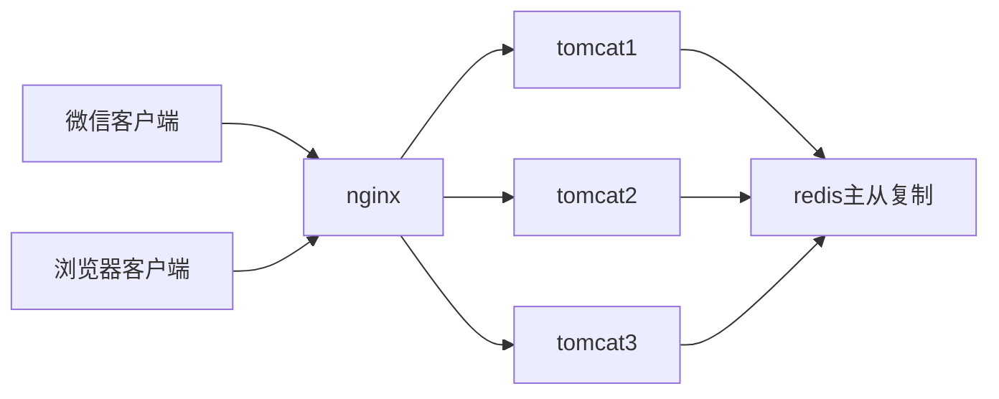

#### 登录概念
登录其实就是验证用户的身份，验证通过之后再存储用户相关的信息和浏览状态

#### 登录的方式
1. 传统的管理系统会在数据库中插入超级管理人员的初始用户名和密码，后续再由超级管理员通过界面上添加普通管理员的账号和密码，再往后普通管理员在登录界面输入用户名和密码完成登录。
2. 微信扫码授权登录，在这个功能中项目初始化的时候其实是在数据库中插入了有访问权限的用户openid,这样微信授权拉取了用户身份后，如果有权限的openid就放行，否则就拒绝，openid相当于密码，用户名不用输入，扫一扫二维码即可。

#### 登出概念
登出本质就是使用户的浏览状态失效

#### *做到这两个功能至关重要的依赖是session*

#### session概念

* 狭义的session：httpsession、J2EE接口

* 广义的session：会话控制

http协议是无状态的，对于同一个url请求并没有上下文关系，当用户完成登录之后，需要有一个机制能够保存用户的信息和状态，再后续的请求中能验证用户的身份和检查用户信息，这个依赖就是会话控制。

**_session可以理解为一种保存key-value的机制_**

session机制中的关键点是如何设置和获取key，如何保存和获取正确的value

###### 从key的方面看
会话有两种常规的方式
1. sessionId
客户端请求服务端的时候，服务的通过setcookie就可以再http头里面设置sessionId这个key和value值，而客户端的cookie会将这个保存住，后续的请求里面会自动的带上

2. token
使用token的时候，需要手动在http中head头里或者url里设置token这个字段，服务器收到请求之后再从head头里或者url里取出token进行验证。安全方面比较严格的话会配合签名一起使用。

* 无论是sessionId还是token，它们都一定是全局唯一的，一个用户一个标识，它的本质就是一个key，这个key对应的用户信息就是value。无论是key还是value，一方没有保持住，就不可能分辨出这个用户身份，就获取不到这个用户的信息。

#### 分布式系统下的session

>水平扩展：加多两台tomcat服务器，把tomcat1的程序复制到tomcat2和tomcat3服务器上，他们完全是一样的，这种做法就是集群。

_水平扩展用Ip_hash方案有隐患，同一个用户访问一个服务器，访问量大的时候很多用户在访问同一个服务器，这个服务器支撑不了，解决不了session问题_

>垂直扩展：把程序功能做垂直拆分成服务A，服务B和服务C。 tomcat1上部署服务A，tomcat2上部署服务B，tomcat3上部署服务C，把程序的功能做垂直的拆分，之后配置nginx根据访问不同的url访问到不同的tomcat服务器上，这样单台服务器的压力就会减少。

_需要专门的服务保存session信息，其他服务器需要session的时候都找它要，这个服务通常用redis集群主从复制去做。_